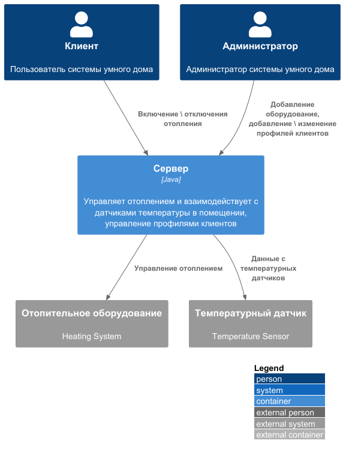
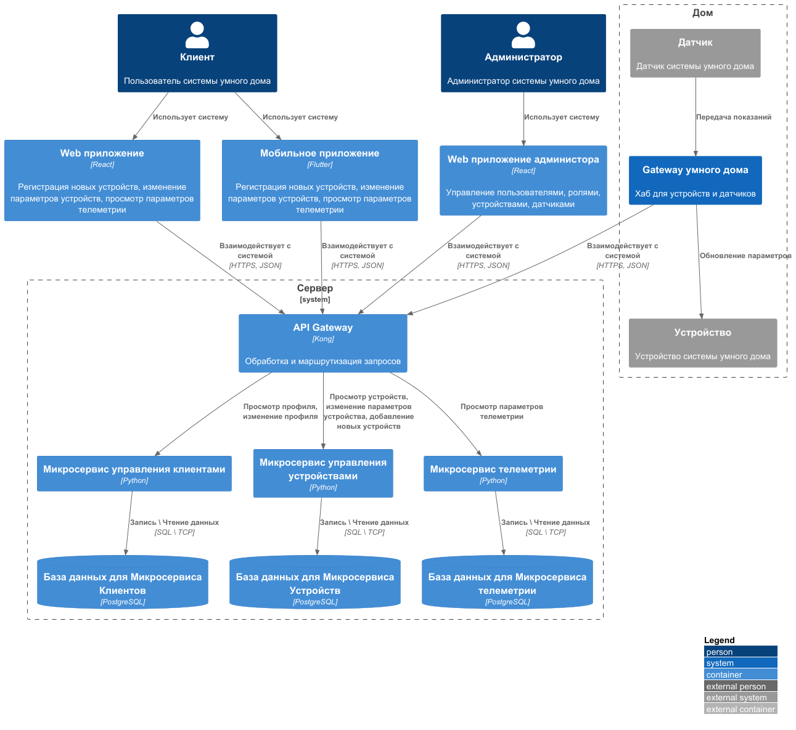
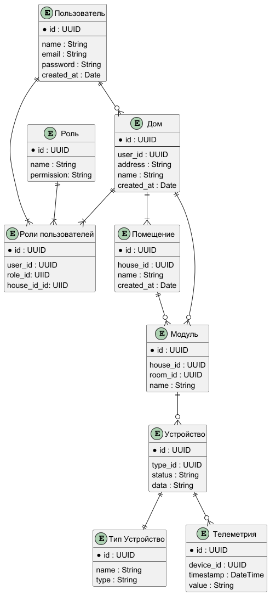

Это шаблон для решения **первой части** проектной работы. Структура этого файла повторяет структуру заданий. Заполняйте его по мере работы над решением.

# Задание 1. Анализ и планирование

Чтобы составить документ с описанием текущей архитектуры приложения, можно часть информации взять из описания компании условия задания. Это нормально.

### 1. Описание функциональности монолитного приложения

**Управление отоплением:**

- Пользователи могут удалённо включать/выключать отопление в своих домах.
- Пользователи могут устанавливать температуру
- Система поддерживает заданную температуру в доме

**Мониторинг температуры:**

- Пользователи могут просматривать текущую температуру в своих домах через веб-интерфейс
- Система поддерживает хранение истории показаний с устройств


### 2. Анализ архитектуры монолитного приложения

Перечислите здесь основные особенности текущего приложения: какой язык программирования используется, какая база данных, как организовано взаимодействие между компонентами и так далее.

- Язык программирования: Java
- База данных: PostgreSQL
- Архитектура: Монолитная, все компоненты системы (обработка запросов, бизнес-логика, работа с данными) находятся в рамках одного приложения. 
- Взаимодействие: Синхронное, запросы обрабатываются последовательно. 
- Масштабируемость: Ограничена, так как монолит сложно масштабировать по частям. 
- Развёртывание: Требует остановки всего приложения.

### 3. Определение доменов и границы контекстов

1. Управление клиентами
   - Регистрация, редактирование профиля клиента
   - Добавление, редактирование дома клиента
2. Управление устройствами
   - Включение и выключение устройства
   - Установка параметров устройства
   - Регистрация устройства
3. Модуль Телеметрии
   - Передача показаний датчиков
   - Просмотр показаний датчиков

### **4. Проблемы монолитного решения**

- Синхронные запросы, отсутствие асинхронных запросов
- Сложность при масштабировании системы
- Ограниченная функциональность
- Сложность при добавлении нового функционала
- Низкая отказоустойчивость
- Сложность при развертывании: требуется остановка всего приложения
- Отсутствие возможности подключить новые устройства клиентом

### 5. Визуализация контекста системы — диаграмма С4

Добавьте сюда диаграмму контекста в модели C4.

Чтобы добавить ссылку в файл Readme.md, нужно использовать синтаксис Markdown. Это делают так:

```markdown
[Визуализация контекста](./docs/docs/context/context.puml)
```

[Визуализация контекста](./docs/docs/context/context.puml)



# Задание 2. Проектирование микросервисной архитектуры

В этом задании вам нужно предоставить только диаграммы в модели C4. Мы не просим вас отдельно описывать получившиеся микросервисы и то, как вы определили взаимодействия между компонентами To-Be системы. Если вы правильно подготовите диаграммы C4, они и так это покажут.


**Диаграмма контейнеров (Containers)**
```markdown
[Диаграмма контейнеров (Containers)](./docs/docs/containers/containers.puml)
```

[Диаграмма контейнеров (Containers)](./docs/docs/containers/containers.puml)



**Диаграмма компонентов (Components)**
```markdown
[Диаграмма компонента клиентов (Components)](./docs/docs/components/component_client.puml)

[Диаграмма компонента устройств (Components)](./docs/docs/components/component_devices.puml)

[Диаграмма компонента телеметрии (Components)](./docs/docs/components/component_telemetry.puml)
```

[Диаграмма компонента клиентов (Components)](./docs/docs/components/component_client.puml)

[Диаграмма компонента устройств (Components)](./docs/docs/components/component_devices.puml)

[Диаграмма компонента телеметрии (Components)](./docs/docs/components/component_telemetry.puml)

**Диаграмма кода (Code)**
```markdown
[Диаграмма кода (Code)](./docs/docs/code/code.puml)
```
[Диаграмма кода (Code)](./docs/docs/code/code.puml)

# Задание 3. Разработка ER-диаграммы

Добавьте сюда ER-диаграмму. Она должна отражать ключевые сущности системы, их атрибуты и тип связей между ними.

```markdown
[ER-диаграммы](./docs/docs/er/er.puml)
```

[ER-диаграммы](./docs/docs/er/er.puml)


